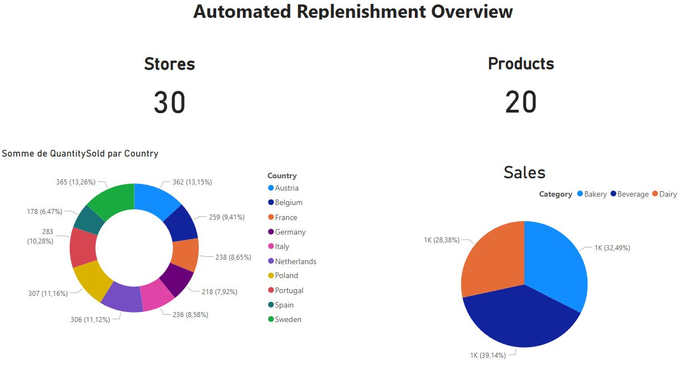
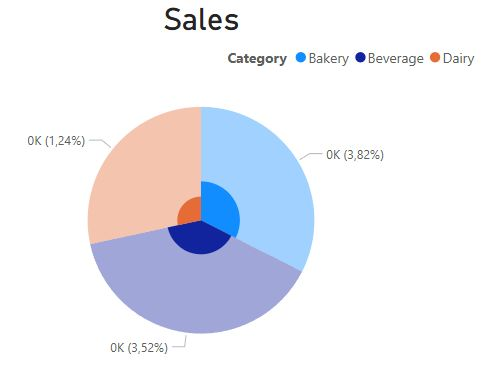
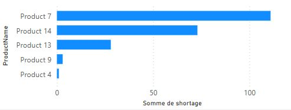
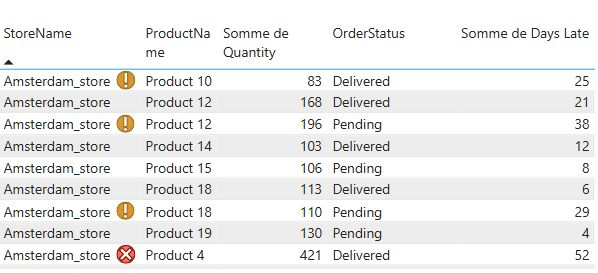

# Automated Replenishment Dashboard

### A PowerBI Solution for Monitoring Supply Chain Performance

<!-- 
Hello, my name is Dimitri MARCHAND, I am a data science student and I'm excited to present my project on Automated Replenishment System dashboard today.

In today's rapidly evolving retail landscape, maintaining optimal inventory levels while minimizing costs has become increasingly complex. my PowerBI dashboard addresses these challenges head-on by providing real-time insights and actionable intelligence to supply chain experts.

I wanted to prototype a valuable solution therefore I simulated data and built a powerBI dashboard that you can see now. 
-->

---

<!--
first tab, most important indicator
-->

---

<!--
second tab, wiuth more granular data
-->

---

<!--
third tab, with emphasis on replenishment
-->

---
## Agenda

1. Project Context  
2. Key Objectives   
4. Data Modeling  
5. Visualizations Overview  
7. Challenges Faced  
8. Recommendations & Next Steps  
9. Q&A

<!-- 
Let's walk through today's agenda. We'll start with the project context to understand why this dashboard was necessary. Then we'll examine my key objectives and the data modeling approach that supports them.

The bulk of my time will be spent exploring the various visualizations I've implemented and how they address specific business needs. We'll also discuss the challenges I encountered and overcame during development.

-->
---

## Project Context

- **Objective:** Implement a monitoring system for replenish several stores
- **Role:** Data Scientist designing a monitoring dashboard.
- **Goal:** Ensure product availability while minimizing overstock.
- **Challenge:** Visualize stock levels, sales trends, and order statuses.

<!--
Let me set the stage for the use case. The project is to imagine a  retail network who has been expanding rapidly, and with that growth came increasing complexity in managing inventory across multiple locations. Manual monitoring became unsustainable, leading to both stockouts and overstock situations that were costing us significantly.

Here, the data scientist role isto create a dashboard that could serve as a single source of truth for my supply chain teams. This meant not just displaying data, but transforming it into actionable insights that could drive better decision-making.

-->
---

## Key Objectives

1. **Monitor Current Performance**  
   - Track stock levels and replenishment success.
2. **Highlight Issues**  
   - Identify low stock, delayed orders, and underperforming stores.
3. **Enable Manual Intervention**  
   - Provide insights for managing exceptions.
4. **Facilitate Data Exploration**  
   - Filtering by store, product, or region.

<!--
Objectives are typically a job centric skill and in this case I would have extensive consultations with supply chain managers, store operators, and logistics teams. To sum up, monitoring current performance isn't just about showing numbers - it's about providing context. My dashboard shows not just current stock levels, but how they compare to historical patterns and predetermined thresholds.

Issue highlighting is crucial because in a large operation, problems can easily go unnoticed until they become critical. I implemented a basic alert system that considers multiple factors -

Data exploration was designed to be intuitive yet powerful. Users can start with a high-level view and progressively filter down to specific regions, stores, or products, maintaining context at each level of detail.
-->
---

## Synthetic Data Generation

### **Data Sources**
- **Sales Data:** Daily transactions, product categories, revenue.
- **Inventory Data:** Stock levels, thresholds, trends.
- **Replenishment Orders:** Order dates, statuses, delivery timelines.
- **Store Locations:** Country, city, latitude, longitude.

### **Key Columns**
- `StoreID`, `ProductID`, `Category`, `StockLevel`, `ReplenishmentThreshold`
- `OrderDate`, `DeliveryDate`, `OrderStatus`, `SupplierID`
- `Latitude`, `Longitude`

<!--
To develop and test this dashboard effectively, I needed comprehensive data that would reflect real-world scenarios.

I created interconnected datasets that capture the essential relationships between sales, inventory, and replenishment processes.

Replenishment orders reflect varying lead times and occasional delays that are common in real supply chains.

-->

---

## Data Modeling

<!--
The data model you see here is the backbone of my entire dashboard system. Its design was crucial for ensuring both performance and flexibility.

At the center, I have my fact tables - Inventory and Sales - which capture the dynamic aspects of my operation. These are surrounded by dimension tables that provide context and enable rich analysis capabilities.

The relationships between tables were carefully structured to support both detailed analysis and high-level aggregations. For example, the connection between Stores and Sales allows us to analyze performance at any geographic level - from individual stores up to entire regions.

-->
---

### the Product Table

| ProductID | ProductName | Category | ReplenishmentThreshold |
|-----------|-------------|----------|------------------------|
| 1         | Product 1   | Bakery   | 6                     |
| 2         | Product 2   | Beverage | 11                     |
| 3         | Product 3   | Beverage | 12                     |

<!--
The Product table is more than just a list of items - it's a crucial component that drives my replenishment logic. Each product's replenishment threshold is a domain-centric capital data, yet it was quite randomy set.

-->
---

### the Inventory Table

| StoreID | ProductID | StockLevel |
|---------|-----------|------------|
| 1       | 1         | 92         |
| 1       | 2         | 85         |
| 1       | 3         | 48         |

<!--
[1 minute]
The Inventory table represents my real-time stock position across all locations. What's particularly interesting here is how I track StockLevel - it's not just a static number, but a dynamic value that updates throughout the day.

-->

---

### the Store Table

| StoreID | Country | City      | Latitude | Longitude | StoreName     |
|---------|---------|-----------|----------|-----------|---------------|
| 1       | France  | Paris     | 48.8566  | 2.3522    | Paris_store   |
| 2       | France  | Lyon      | 45.764   | 4.8357    | Lyon_store    |
| 3       | France  | Marseille | 43.2965  | 5.3698    | Marseille_store|

<!--
[1.5 minutes]
my Store table is more than just a list of locations - it's a crucial component for my geospatial analysis. The inclusion of latitude and longitude coordinates enables sophisticated mapping capabilities.

-->
---

### the Replenishment Orders Table

| OrderID | StoreID | ProductID | OrderStatus | Quantity | DeliveryDate |
|---------|---------|-----------|-------------|----------|--------------|
| 1       | 13      | 19        | Pending     | 130      | 2025-01-27   |
| 2       | 15      | 6         | Pending     | 71       | 2025-01-14   |
| 3       | 23      | 8         | Pending     | 184      | 2025-01-13   |

<!--
The Replenishment Orders table is where I track the lifecycle of every order in my system. Each order has its own unique identifier and carries crucial timing information.

The OrderStatus field is crucial for an operations team. While these examples show 'Pending' status, I track multiple states including 'In Transit', 'Delayed', and 'Delivered', enabling us to proactively manage any supply chain disruptions.
-->
---

### the Sales Table

| Date       | ProductID | QuantitySold | StoreID | Revenue |
|------------|-----------|--------------|---------|---------|
| 2025-01-19 | 16        | 5            | 12      | 27      |
| 2025-01-02 | 16        | 6            | 1       | 16      |
| 2025-01-11 | 8         | 5            | 1       | 41      |

<!--
my Sales table captures the heartbeat of my retail operations. Each transaction is recorded with temporal, quantitative, and financial dimensions.

This granular sales data is crucial for my demand forecasting algorithms and helps determine optimal reorder points. I can identify not just how much we're selling, but also when we're selling it, enabling better inventory planning.
-->
---

## Why visualize?

- **Visualize KPIs:** Total Stores, Stockouts, Replenishment Success Rate.
- **Stock Trends:** Compare stock levels vs. thresholds.
- **Sales Trends:** Analyze trends over time.
- **Replenishment Table:** Track order statuses.
- **Store Performance:** Compare performance by store.
- **Geospatial Map:** Visualize stockout risks by country.

<!--
The choice of visualizations wasn't arbitrary - each visual element was selected to address specific business needs and cognitive principles. Let me explain my thinking behind each one.

KPIs are presented prominently because they provide immediate context for all other metrics. I carefully selected these metrics to give a balanced view of both operational efficiency and customer service levels.

The stock trends visualization uses both absolute levels and relative comparisons to thresholds. This dual approach helps users quickly identify not just current issues, but emerging problems before they become critical.

Although it is not part of this exercice, I add that sales trend analysis benefit from granular data, thus a correct timestamp is capital.

The geospatial visualization was particularly important for my multi-country operation. It helps identify regional patterns that might be missed in tabular data, such as weather-related impacts or regional preferences affecting stock levels.
-->
---

<!--
The first tab of my dashboard serves as a high-level overview that answers the most crucial questions my supply chain managers have. Let me walk you through its design principles.

The revenue and sales circle charts provide immediate insights into performance across countries and categories. I chose circular visualizations here because they excel at showing proportional relationships while making efficient use of space.

The interactive nature of these charts was a key design decision. Users can quickly isolate specific segments to investigate patterns or anomalies, making it an effective tool for both routine monitoring and deep-dive analysis.
-->
---

### the plots are interactives!

<!--  
I can select either a coutry or a category to check a pattern. For example, my simulation gindicatesq that italian stores low dairy sales
-->
---

## Dashboard Tab 2: Overview of shortages

### **Detailed Analysis**
- **spatial information**  
   - where do stockouts occur?
- **KPI cards**  
   - Are the stockouts important?
   - Are the replenishment orders on time?

<!--
In the second tab, I wanted to provide a more detailed analysis of stockouts and replenishment performance. Let's take a closer look at the design choices I made here.
The first section, 'Where do stockouts occur?', is a spatial visualization. This was a deliberate choice because it allows users to quickly identify patterns in stockouts across different countries.
The second section, 'Are the stockouts important?', is a set of KPIs. These KPIs provide a quantitative assessment of the severity of stockouts.

-->
---

<!--
This second tab allows deeper investigation. Users can track sales trends and identify supply chain bottlenecks.
In particular, I found interesting to see the shortage per product. 
-->
---

## Dashboard Tab 3: Interactive order tracking

- **Replenishment Table**  
   - Track repleishment order statuse
   - Filter by store, product, or order status.
   - inside symbols for days late range

- **products mostly late**  
   - Which products are most often delayed

- **delivery delai statistics**
   - How many days late are the deliveries?

<!--
I designed a thrird tab to allow deeper investigation. Users can track sales trends and identify supply chain bottlenecks.
To desin it, I asked myself:
- How can I provide a detailed view of replenishment orders?
- How can I identify the most frequently delayed products?
- How can I visualize the average delay per product?

-->

---
### 

<!--  
A little look on the visuals.
-->
---

## Recommendations & Next Steps

1. **Build Sale & Delay Predictive Models**  
   - Improve demand forecasts, optimize inventory levels.
2. **Automate Reporting**  
   - Set up scheduled email alerts for critical KPIs.
3. **Expand Scope**  
   - Include supplier performance metrics and cost analyses.
4. **User Training**  
   - Workshops for effective dashboard usage.

<!--  
In my opinion, he next steps involve refining predictive analytics, automating alerts, and expanding the dashboard's capabilities.
-->
---

# Thank You  
### a look on the dashboard
### Questions?

<!--  
Thank you for your time! I am happy to take any questions about the dashboard and its design.
-->